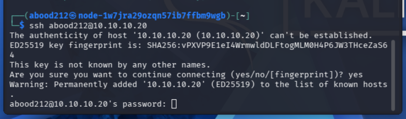
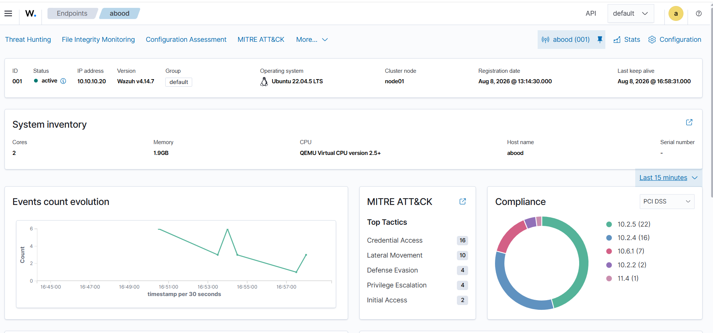
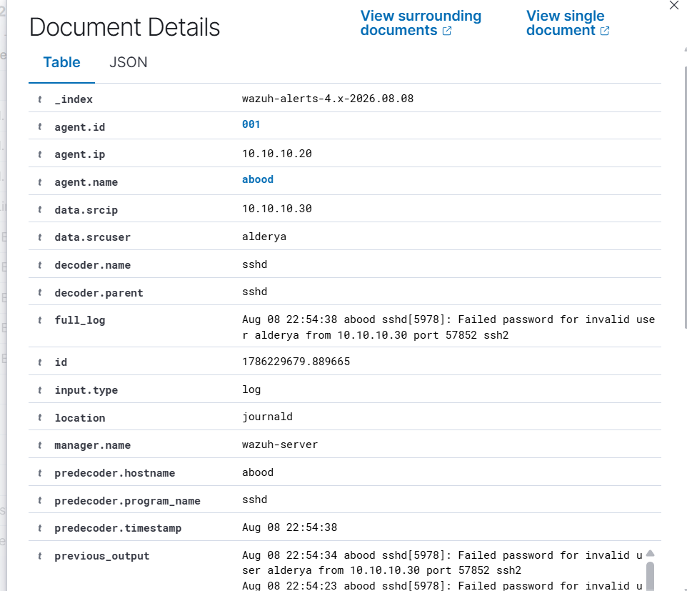
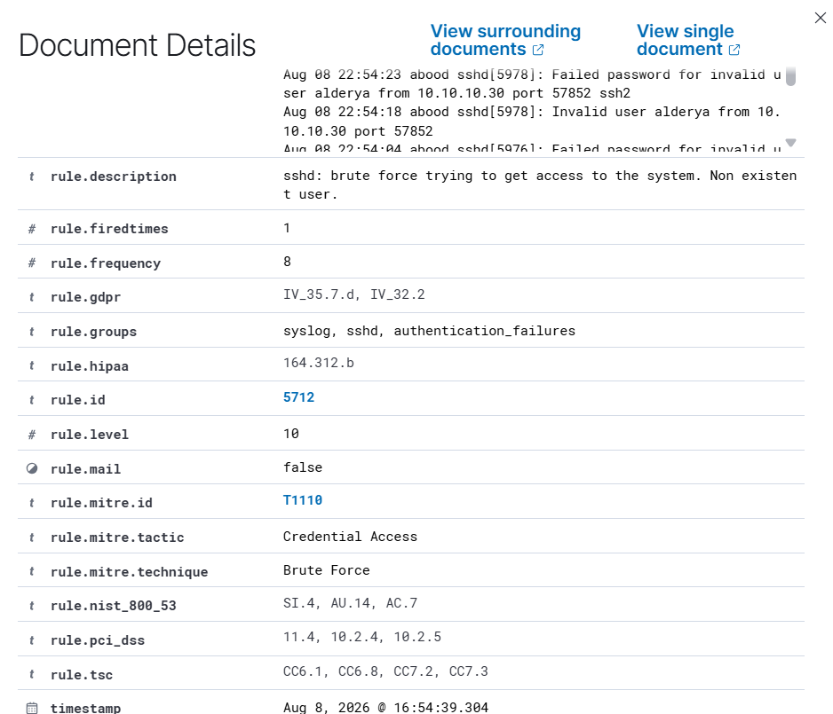
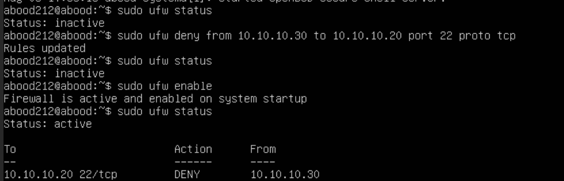
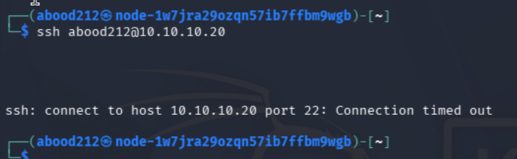

# Virtual SOC Lab

I built this lab to get hands-on experience with how attacks actually appear from a SOC analyst's point of view. Instead of only reading about SIEM alerts and brute-force attacks, I wanted to generate the activity myself, see what Wazuh detected, investigate the logs, and then apply a firewall rule to stop the traffic.

The lab runs in **Proxmox** and uses **Kali Linux as the attacker, Ubuntu Server as the victim, and Wazuh for security monitoring and log analysis**.

## Lab Setup

The environment consists of:

* **Kali Linux** – attacker machine (`10.10.10.30`)
* **Ubuntu Server** – victim machine (`10.10.10.20`)
* **Wazuh Agent** – installed on the Ubuntu server
* **Wazuh Server** – collects and analyzes security events
* **Proxmox VE** – hosts the virtual environment
* **UFW** – used on Ubuntu to control traffic

The Kali and Ubuntu machines were placed on the same private virtual network so I could generate traffic between them without exposing the lab to an external network.

## 1. Testing SSH Connectivity

Before generating failed logins, I tested SSH connectivity from Kali to the Ubuntu server.

```bash
ssh abood212@10.10.10.20
```

Ubuntu responded on port 22 and asked for the user's password, confirming that SSH was reachable from the attacker machine.



## 2. Simulating Failed SSH Logins

From Kali, I attempted to SSH into the Ubuntu server using incorrect usernames and passwords.

For example:

```bash
ssh abdulmajeed2000@10.10.10.20
ssh alderya@10.10.10.20
```

I intentionally entered incorrect passwords multiple times to generate authentication failures that Wazuh could detect.


## 3. Detecting the Activity in Wazuh

The Wazuh agent running on Ubuntu collected the authentication events and sent them to the Wazuh server.

The alerts showed several types of SSH-related activity, including:

* `sshd: authentication failed`
* `PAM: User login failed`
* `sshd: Attempt to login using a non-existent user`
* `syslog: User missed the password more than one time`
* `sshd: brute force trying to get access to the system. Non existent user.`

This was useful because I could see how several individual authentication failures eventually became a higher-severity brute-force alert.



## 4. Investigating the Brute-Force Alert

I opened the alert in Wazuh to look at the event in more detail.

The logs identified:

* **Victim:** `10.10.10.20`
* **Source IP:** `10.10.10.30`
* **Service:** SSH
* **Decoder:** `sshd`
* **Rule ID:** `5712`
* **Rule Level:** `10`
* **Attack type:** Brute Force

The source IP matched my Kali machine, which confirmed that the alert was generated from the activity I created in the lab.



The event logs also showed the failed username and the source IP responsible for the attempts.



## 5. MITRE ATT&CK Mapping

Wazuh mapped the activity to:

**MITRE ATT&CK T1110 – Brute Force**

under the **Credential Access** tactic.

The rule was configured to trigger after repeated authentication failures from the same source IP, allowing multiple failed logins to be correlated into a more serious alert.


This part of the lab helped me understand the difference between seeing individual failed-login events and identifying a pattern that could represent an attack.

## 6. Blocking the Attacker

After identifying `10.10.10.30` as the source of the SSH attempts, I created a UFW firewall rule on the Ubuntu server to deny SSH traffic coming from that IP.

```bash
sudo ufw deny from 10.10.10.30 to 10.10.10.20 port 22 proto tcp
sudo ufw enable
sudo ufw status
```

The resulting rule denied traffic from the Kali machine to TCP port 22 on the Ubuntu server.



## 7. Verifying the Block

Finally, I returned to Kali and attempted another SSH connection to the Ubuntu server.

```bash
ssh abood212@10.10.10.20
```

This time the connection timed out instead of reaching the SSH login prompt.



That confirmed that the firewall rule was blocking SSH traffic from the attacker machine.

## What I Learned

The biggest reason I built this lab was to connect the different parts of security monitoring together.

I got hands-on practice with:

* Building an isolated virtual security lab in Proxmox
* Connecting and testing Linux systems on a private network
* Generating SSH authentication failures
* Monitoring an endpoint with a Wazuh agent
* Reading and investigating authentication logs
* Identifying the source and destination involved in an alert
* Understanding Wazuh rule IDs and severity levels
* Mapping detected activity to MITRE ATT&CK
* Responding to suspicious activity with a firewall rule
* Testing the control afterward to make sure it actually worked

The lab gave me a much clearer picture of the basic SOC workflow:
